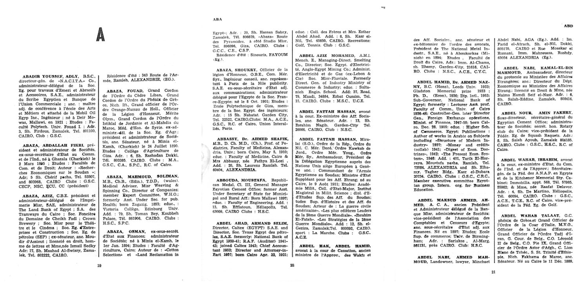

# Encyclopedia to Data

The goal is to turn an encyclopedia into structured data.
Turn scanned pages of a biographical encyclopedia into a searchable PDF, then one text record per biography, and then structured JSON and CSV tables using an OpenAI model to extract and fill in different fields.


This is a working, small-scale version of a workflow I built for historical research for a project from Samuel Bazzi (UCSD) and Serena Canaan (SFU). The example uses three pages of a mid-twentieth-century biographical encyclopedia with entries in French and English. Those pages contain the problems that make this kind of source hard: an upside-down scan, a two-column layout, running heads and page numbers mixed into the text, biographies that continue in the next column or on the next page, and OCR noise.



*The three sample pages as the OCR stage leaves them. In the raw scan the first page is upside down; after correction the parser still has to read two columns in order, drop the running heads and page numbers, and keep entries together when they continue in the next column or on the next page.*

## What is in the repository

| Directory | Contents |
| --- | --- |
| `scripts/` | The pipeline: four files, described in the next section, plus the tests. |
| `examples/` | Saved outputs of a complete run over the three-page sample, so every stage can be inspected without an API key. |
| `docs/` | Field definitions, validation notes, reuse notes, and the hand-checked entry inventory. |
| `data/raw/` | The three-page scan and its provenance manifest; see the [reuse notes](docs/reuse.md). |
| `outputs/` | Your working directory, ignored by Git. |

## Where to change things for your own book

The code is split into three tiers, and every file states which tier it belongs to:

| Tier | File | Change it when |
| --- | --- | --- |
| Generic | `scripts/pipeline.py` | You want another model provider, output format or caching strategy. It knows nothing about biographies. |
| Encyclopedia | `scripts/extract_biographies.py` | Your source is not a printed reference work with columns, running heads and one heading per entry. Otherwise leave it alone. |
| This project | `scripts/book_settings.py` | Always. Page geometry, heading style, section labels, OCR languages and model defaults, with a comment on every rule. Work through it top to bottom. |
| This project | `scripts/biography_schema.py` | You want other fields. The prompt and the JSON schema change together. |

The parser runs offline in seconds, so the loop for a new book is: cut a 20-page sample, run `ocr` once, then edit `book_settings.py` and rerun `extract` until `outputs/entries.csv` lists one row per person. Only then pay for the model.

## Explore the example

| File | What to inspect |
| --- | --- |
| [lines.txt](examples/lines.txt) | The OCR text in reading order, left column before right, with page numbers |
| [entries.csv](examples/entries.csv) | One biography per row with its source page range |
| [biographies.json](examples/biographies.json) | Structured fields, evidence quotes and review flags |
| [biographies.csv](examples/biographies.csv) | The same records as spreadsheet columns |
| [validation.json](examples/validation.json) | Record counts and automated checks |

The example run produced 21 records, 5 of them flagged for review. The [validation notes](docs/validation.md) explain each flag and record how the parser was tested against three complete books; the [data dictionary](docs/data_dictionary.md) defines every field.

## Install

Python 3.12, plus two native tools that pip does not install: Tesseract OCR with the language packs you need (`eng`, `fra` and `osd` for the sample) and Ghostscript. Follow the [OCRmyPDF installation instructions](https://ocrmypdf.readthedocs.io/en/latest/installation.html) for your system.

Windows PowerShell:

```powershell
python -m venv .venv
.\.venv\Scripts\python.exe -m pip install -r requirements-lock.txt
tesseract --list-langs
gswin64c --version
.\.venv\Scripts\python.exe scripts/pipeline.py --help
```

On macOS and Linux use `.venv/bin/python` instead of `.\.venv\Scripts\python.exe`, and `gs` instead of `gswin64c`. `requirements.txt` lists the direct dependencies; `requirements-lock.txt` pins the exact versions that were tested on Windows; `environment.yml` is a Conda alternative.

## Run it stage by stage

Every stage writes to `outputs/` by default; change that with `--output`.

**1. Cut a sample from your scan and write its manifest.**

```powershell
.\.venv\Scripts\python.exe scripts/pipeline.py sample --input "PATH/TO/YOUR/BOOK.pdf" --first 4 --last 6 --printed-first 19
```

Start on a page that begins with a new entry: text before the first heading is dropped. Edit the generated `data/raw/source.json` if the last entry on your last page is complete (`last_entry_incomplete`).

**2. OCR.** Corrects rotation and skew and adds a text layer. The included sample runs as is; for your own book do step 1 first. Use `--jobs 0` for all cores on a big book, and `--skip-text` if some pages already carry text.

```powershell
.\.venv\Scripts\python.exe scripts/pipeline.py ocr
```

**3. Split into entries.** Reads the columns in order, removes page numbers and running heads, joins wrapped headings and hyphenated words, and sets aside blocks that are not people.

```powershell
.\.venv\Scripts\python.exe scripts/pipeline.py extract
```

Read `outputs/entries.csv`, `outputs/lines.txt` and `outputs/skipped.json` before spending money. Segmentation mistakes propagate into everything downstream.

**4. Put your API key in a local file.**

```powershell
Copy-Item .env.example .env
```

Replace the placeholder in `.env` with your key. The file is ignored by Git, and an existing `OPENAI_API_KEY` environment variable takes precedence.

**5. Extract fields with the model.** Preview, test one entry, then run all.

```powershell
.\.venv\Scripts\python.exe scripts/pipeline.py structure --dry-run
.\.venv\Scripts\python.exe scripts/pipeline.py structure --limit 1
.\.venv\Scripts\python.exe scripts/pipeline.py structure --workers 3
```

Each entry is one Responses API request with a strict JSON schema; the model sees only that entry's text. Every successful response is saved immediately in `outputs/responses/`, so an interrupted run resumes where it stopped and rerunning with the same inputs and settings costs nothing. Changing the prompt, the schema, the model or an entry's text invalidates the saved response by design; use a new `--output` directory.

The defaults are `gpt-5-mini` with `high` reasoning effort and a 50,000 output-token cap that includes reasoning tokens. For a model without reasoning, pass `--reasoning none`. Rate limits, connection drops and server errors are retried up to `--max-retries` times with backoff; a request that still fails stops the run with its progress saved. With high reasoning effort a request can take minutes.

**6. Export and validate.**

```powershell
.\.venv\Scripts\python.exe scripts/pipeline.py export
.\.venv\Scripts\python.exe scripts/pipeline.py validate
```

`biographies.json` keeps the nested result; `biographies.csv` expands lists into numbered columns such as `data_education_1_degree`. Validation checks that every evidence quote is an exact substring of the text sent to the model, that IDs match across files, and that review flags are consistent. It does not establish factual accuracy: compare flagged records with the scan.

`run` executes stages 2 to 6 in one go:

```powershell
.\.venv\Scripts\python.exe scripts/pipeline.py run --output outputs/fresh-run
```

## Cost

Cost depends on the number and length of entries, the prompt, the model and the reasoning effort. `outputs/usage.json` totals the tokens of saved successful responses. Two data points: the three-page example run used 78k input and 225k output tokens, 209k of them reasoning tokens; and in December 2025 I processed a whole book of several hundred pages for roughly US$20 with a GPT-5-family model. Check the [current pricing](https://developers.openai.com/api/docs/pricing) and your billing page. For whole books the [Batch API](https://developers.openai.com/api/docs/guides/batch) is cheaper and is a natural extension of the `structure` stage; it is not implemented here.

## Limits

- OCR corrupts names, dates and abbreviations, and the parser cannot recover text that OCR did not read.
- Heading detection is heuristic. Across three complete books it produced record counts within 1.5% of my earlier research parser with no empty records, but it still merges or splits a few entries per hundred pages. The [validation notes](docs/validation.md) list the known cases.
- An evidence quote proves that the text exists, not that the model interpreted it correctly. `needs_review = false` is not human approval.
- The model splits names into first, middle and last. For unfamiliar naming conventions, treat that split as a suggestion.

## Tests

```powershell
.\.venv\Scripts\python.exe -m unittest discover -s scripts -p "test_*.py" -v
```

Twenty offline checks: synthetic pages for each parser rule, the hand-checked inventory of the sample (skipped when the scan is absent), schema and evidence checks, and the caching and failure behaviour of the API stage with the client mocked. They never call the API, and the same suite runs in GitHub Actions.

## License

MIT for the code. The encyclopedia pages and the derived example text are not covered; see the [reuse notes](docs/reuse.md).
